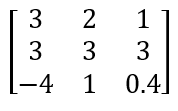
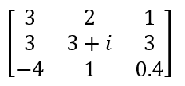
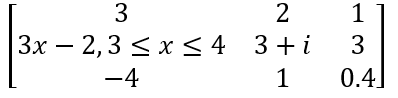

&nbsp; [](https://www.nuget.org/packages/EMDD.KtMatrix/)[](https://www.nuget.org/stats/packages/EMDD.KtMatrix?groupby=Version&groupby=ClientName&groupby=ClientVersion)[](https://github.com/marlond18/EMDD.KtMatrix/actions/workflows/runTest.yml)
&nbsp; 
----------------
# EMDD.KtMatrix
a library for matrix operations

## Requirements

[.Net 5.0.102 sdk](https://dotnet.microsoft.com/download/dotnet/5.0) or greater

## Nuget Package Usage

https://www.nuget.org/packages/EMDD.KtMatrix/

`<PackageReference Include="EMDD.KtMatrix" Version="*.*.*" />`


## Usage
I guess this library can be useful for you if you are working with matrices whose elements are:
- basic numeric values
- complex numbers
- basic polynomial equations
- basic math expressions

### Basic Matrix
this

can be represented as a light-weight matrix as
```c#
    var matrix = new EMDD.KtMatrix.LightWeight.LWMatrix(new[,] {
        { 3, 2,   1},
        { 3, 3,   3},
        {-4, 1, 0.4});
```

or 

```c#
    var matrix = new EMDD.KtMatrix.Matrix(new[,] {
        { 3, 2,   1},
        { 3, 3,   3},
        {-4, 1, 0.4} 
    });
```

### Matrix with complex numbers
this 

can be represented as 

```c#
    var matrix = new EMDD.KtMatrix.Matrix(new EMDD.KtNumerics.Number[,] {
        { 3,                   2,    1},
        { 3,  new KtComplex(3,1),    3},
        {-4,                   1,  0.4} 
    });
```
### Matrix with piece-wise functions
this 

can be represented as 

```c#
    var eq = EMDD.KtPolynomials.KtPolynomial.Create(3, -2);
    var lim = EMDD.KtExpressions.Limits.Limit.Create(3, 4);

    var exp = new EMDD.KtExpressions.Expression((eq, lim));
    var comp = new EMDD.KtNumerics.KtComplex(3, 1);

    var matrix2 = new EMDD.KtMatrix.Matrix(new EMDD.KtExpressions.Expression[,] {
        { 3,       2,    1},
        { exp,  comp,    3},
        {-4,       1,  0.4}
    });
```

### Math Ops
- Addition, Subtraction, Scalar/Matrix multiplication and Matrix-Dot Product, Division with constant

### Other Methods
- Square Matrix Inverse, Determinant
- Matrix Transpose
- Guassian Elimination

## TODO
- Create proper examples